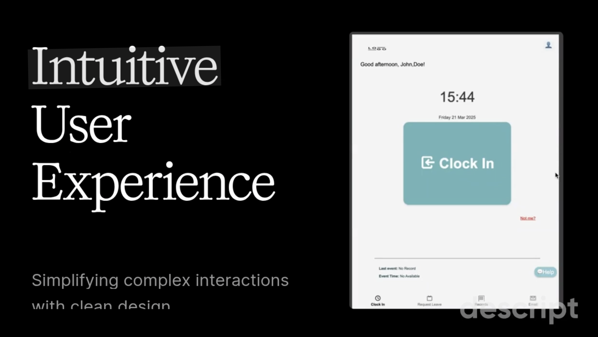
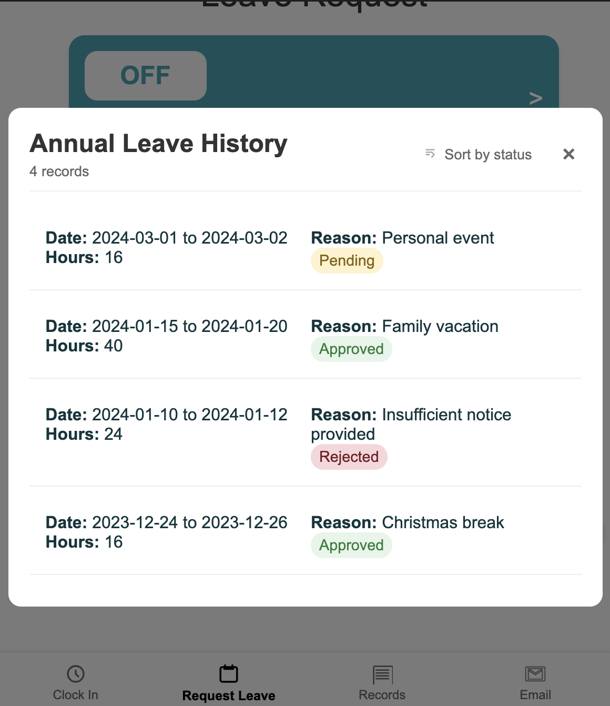
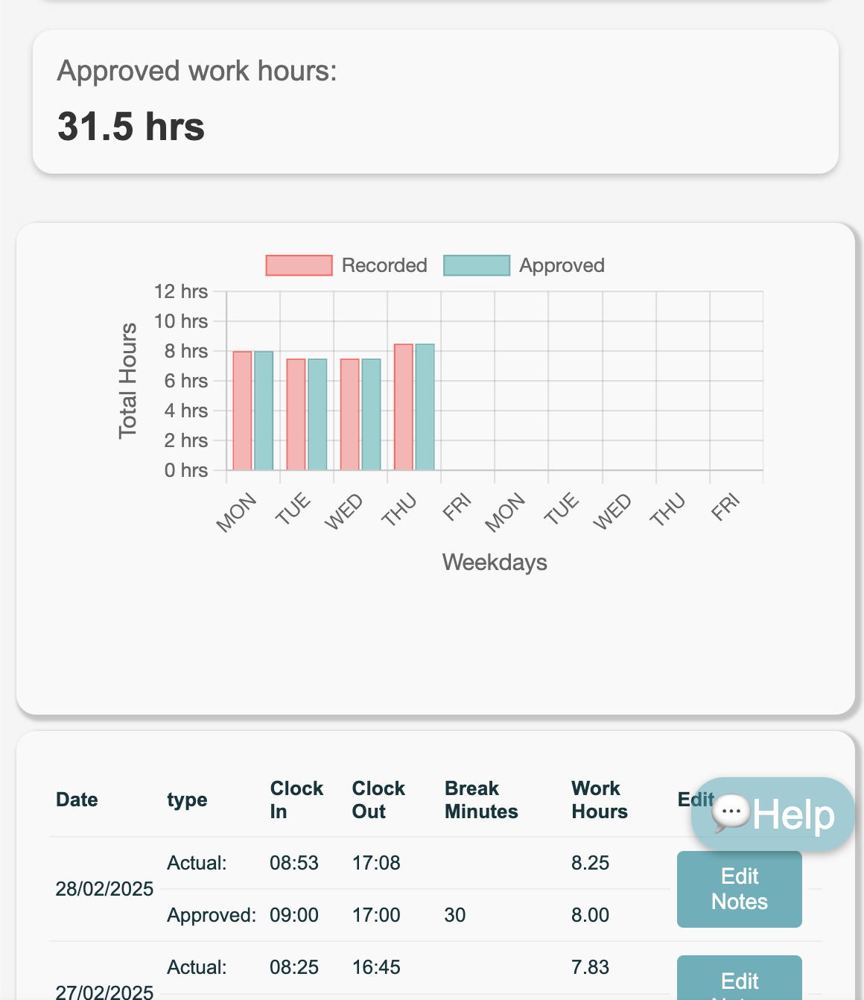
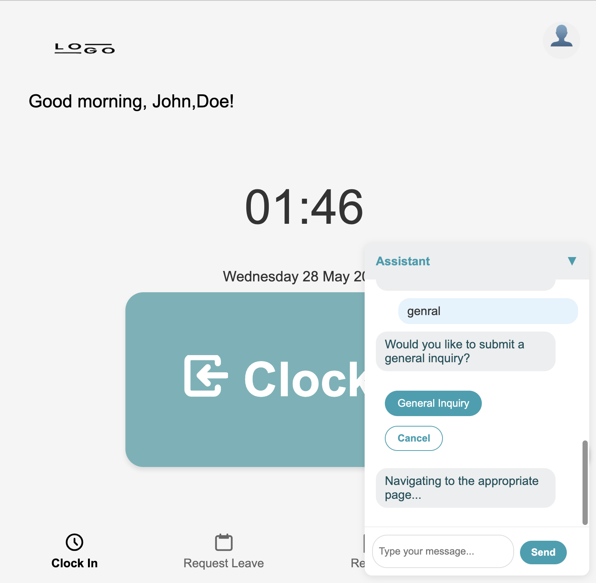

#employee-hr-webapp 

[](https://lit.dev/)
[](https://www.javascript.com)
[](https://www.w3.org/Style/CSS/)
[](https://github.com)
[](https://nodejs.org/)
[](https://www.figma.com)
[](https://www.chartjs.org)

## Project Overview
A modern web application showcasing frontend development skills using web components and modern JavaScript. This project demonstrates proficiency in UI/UX design, data visualization, and component architecture, developed with AI assistance to implement best practices.

## Project Demo

### Video Demonstration
<div align="center">
  <a href="docs/demo.mp4">
    
  </a>
  <p><em>Click to watch the demonstration</em></p>
</div>

*This demonstration showcases:*
- Interactive data visualizations
- Real-time updates and transitions
- Responsive design across devices
- User flow through key features
- Dynamic chart interactions
- Form handling and validation

### Featured Capabilities:
- Application overview and architecture
- Data visualization implementations
- Real-time interaction patterns
- Responsive design in action
- User flow and experience
- Advanced chart interactions

## Feature Showcase

### Smart Leave Management
<div align="center">
  
  <p><em>Intuitive leave request system with real-time balance tracking</em></p>
</div>

### Data Analytics & Visualization
<div align="center">
  
  <p><em>Advanced data visualization showing work hour patterns and comparisons</em></p>
</div>

### Interactive Chat Assistant
<div align="center">
  
  <p><em>Interactive command interface for quick access to system features and navigation</em></p>
</div>

## Technical Stack
- **Frontend Architecture**:
  - Lit Components for web component development
  - Custom event system for cross-component communication
  - State management through component properties

- **API Integration**:
  - RESTful API consumption for timecard and event data
  - Custom service layer for data handling
  - Event-driven data synchronization
  - Mock data support for development

- **Data Management**:
  - Real-time data processing
  - Custom data formatters
  - Local state caching
  - Error handling and fallbacks

## Technical Implementation

### API Integration & Data Flow
- RESTful endpoint integration
- Token-based authentication
- Custom event dispatching system
- Development/production environment handling
- Mock data implementation for testing

### Service Layer Architecture
- Modular service components
- Data synchronization patterns
- State management across components
- Error handling and recovery

### Component Architecture
- Web Components with Lit
- Custom element definitions
- Shadow DOM encapsulation
- Property-based state management

### Data Processing & Visualization
- Custom chart implementations
- Real-time data updates
- Data transformation pipelines
- Responsive scaling

### Interactive Features
- Command-based interaction
- Quick navigation system
- Custom UI components
- State management

### Form Handling & Validation
- Dynamic form state management
- Real-time validation
- Date range processing
- Balance calculation

## Development
```bash
# Install dependencies
npm install

# Start development server
npm run dev

# Start production server
npm start
```

## Learning Outcomes
- Web Component architecture
- API integration patterns
- Data transformation techniques
- State management strategies
- Component communication
- Modern web development practices

---
*Note: This project demonstrates technical implementation capabilities, design skills, and modern development practices.*
